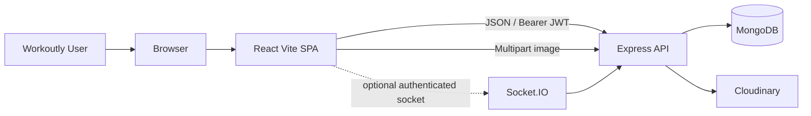
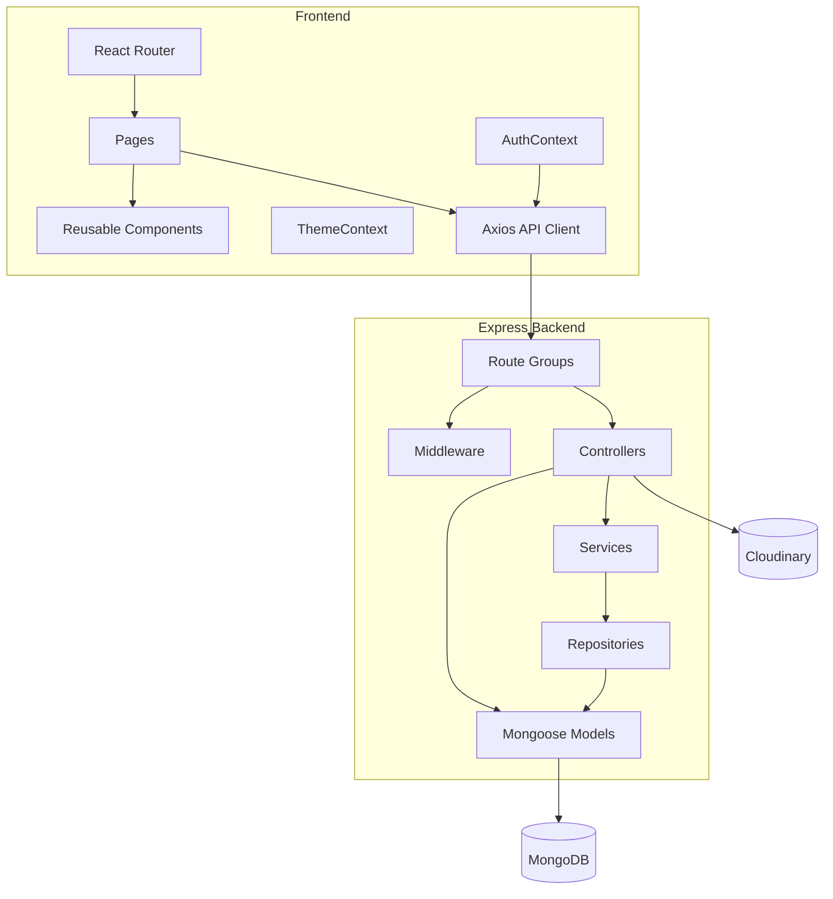
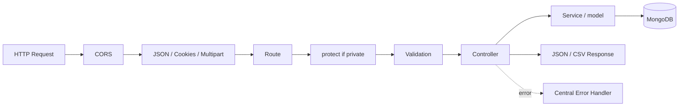
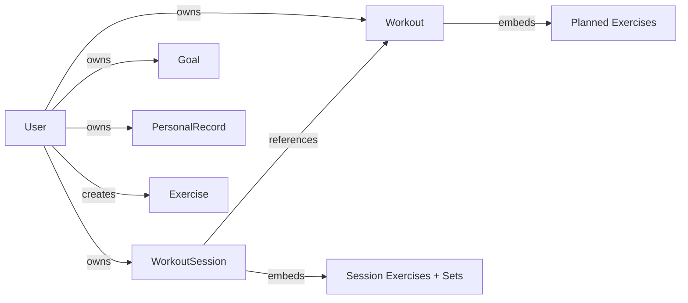
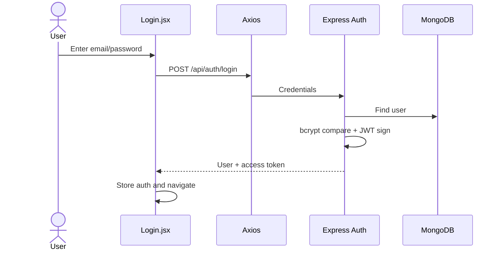
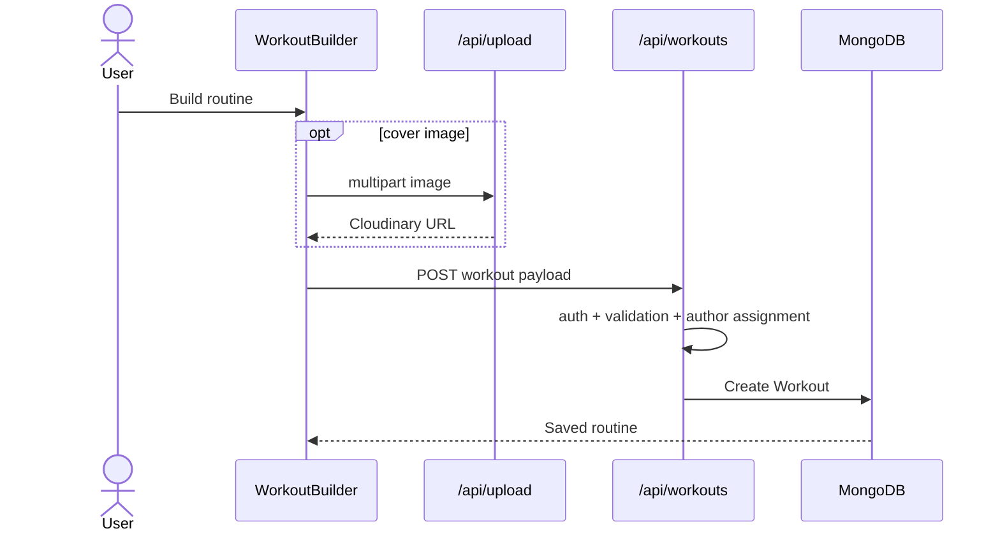
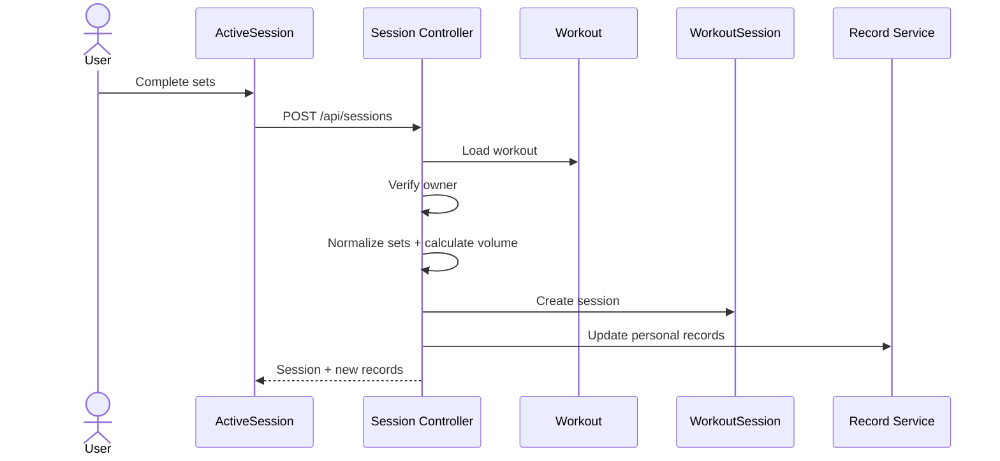

# Workoutly — High-Level Design (HLD)

## 1. Document Information

| Field | Value |
| --- | --- |
| System | Workoutly |
| Repository | `garvitsingh171/workoutly` |
| Snapshot | `main` at `e9ea4d8751af48f6347f4a02c271bbecaf28baa2` |
| Review date | 22 August 2026 |
| Architecture | Browser SPA + REST-style Express API + MongoDB + Cloudinary |

---

## 2. System Overview

Workoutly follows a client/server architecture. The browser runs a React single-page application. The frontend calls an Express API using Axios. The backend authenticates requests, validates and authorizes access, performs business logic, and persists data through Mongoose into MongoDB. Routine cover images are uploaded to Cloudinary.

```text
User
  ↓
React/Vite SPA
  ↓ Axios JSON / multipart / CSV
Express API
  ↓
Authentication + validation + ownership rules
  ↓
Controllers / services / repositories
  ↓
Mongoose
  ↓
MongoDB

Image upload path:
React → Express/multer → Cloudinary
```

---

## 3. Technology Stack

| Layer | Technology | Responsibility |
| --- | --- | --- |
| Frontend | React 19 | Component-based UI |
| Build tool | Vite | Development/build pipeline |
| Routing | React Router | SPA route management |
| Global client state | React Context | Authentication and theme |
| HTTP | Axios | API client, auth interceptor, refresh handling |
| Notifications | react-hot-toast + react-toastify | User feedback |
| Optional realtime | Socket.IO client/server | Authenticated realtime infrastructure, currently lightly used |
| Backend runtime | Node.js | Server runtime |
| API framework | Express 5 | HTTP routing and middleware |
| ODM | Mongoose | MongoDB schemas, persistence, validation |
| Database | MongoDB | Primary application persistence |
| Auth | JWT + bcrypt | Authentication |
| Refresh support | HTTP cookie + refresh JWT | Access token renewal when configured |
| Upload parsing | multer | In-memory multipart file handling |
| Image storage | Cloudinary | Routine cover images |
| Tests | Jest, Supertest, Testing Library | Backend integration and frontend component tests |
| Deployment | Docker, Docker Compose, Nginx, Vercel config | Local/production packaging |

---

## 4. System Context Diagram



---

## 5. Container / Major Component Diagram



---

## 6. Frontend Architecture

### Main layers

```text
client/src/
├── pages/          route-level screens
├── components/     reusable UI and domain components
├── context/        auth and theme state
├── services/       Axios + Socket.IO clients
├── utils/          workout form normalization/validation
├── App.jsx         application routing/composition
└── main.jsx        React bootstrap
```

### Route security model

`ProtectedRoute` improves UX by blocking unauthenticated navigation, but it is **not** treated as real authorization. The backend verifies the JWT and checks ownership again for protected resources.

### State strategy

- Global state: authentication and theme.
- Page-local state: workouts, history, goals, forms, active-session logs.
- Persistence: auth/theme in browser storage; most page/session UI state is in memory.

This avoids a larger global-state dependency such as Redux because the current application scope does not require one.

---

## 7. Backend Architecture

### Main structure

```text
server/
├── app.js                 Express composition
├── server.js              DB + HTTP + Socket.IO startup
├── scripts/               seed data utilities
└── src/
    ├── config/            DB, CORS, Cloudinary
    ├── routes/            API route definitions
    ├── controllers/       request handlers/business orchestration
    ├── services/          reusable business logic
    ├── repositories/      data-access helpers for selected domains
    ├── models/            Mongoose schemas
    ├── middleware/        auth, errors, rate limit, upload
    ├── validators/        express-validator rules
    ├── data/              built-in exercise definitions
    └── utils/             errors, API response, JWT helpers
```

### Request lifecycle



---

## 8. Major Modules

| Module | Responsibility | Major files |
| --- | --- | --- |
| Authentication | Register, login, refresh, logout, JWT verification | `AuthContext.jsx`, `api.js`, `authController.js`, `authService.js`, `token.js`, `auth.js` |
| Users | Own-profile get/update/delete | `userController.js`, `userService.js`, `userRepository.js`, `User.js` |
| Workouts | Routine CRUD and duplicate | `WorkoutBuilder.jsx`, `workoutController.js`, `workoutService.js`, `workoutRepository.js`, `Workout.js` |
| Sessions | Save actual workout execution and history | `ActiveSession.jsx`, `History.jsx`, `sessionController.js`, `WorkoutSession.js` |
| Goals | Weekly target and consistency | `Goals.jsx`, `goalController.js`, `Goal.js` |
| Records | Best-performance tracking | `Records.jsx`, `recordController.js`, `recordService.js`, `PersonalRecord.js` |
| Progress | Exercise-specific historical progress | `Progress.jsx`, session progress API |
| Exercise Library | Defaults + user-created movements | `Exercises.jsx`, `exerciseController.js`, `Exercise.js`, `defaultExercises.js` |
| Upload | Routine image upload | `ImageUpload.jsx`, `upload.js`, `middleware/upload.js`, `cloudinary.js` |
| Theme | Light/dark/system | `ThemeContext.jsx`, `ThemeToggle.jsx` |
| Seed data | Realistic demo and default data | `seedDemo.js`, `seedExercises.js` |

---

## 9. Data Architecture

### Entity relationship overview



### Important modeling decision: template vs session snapshot

`Workout` is the reusable plan.

`WorkoutSession` is the completed historical event. It stores:

- the workout reference,
- a `workoutName` snapshot,
- start/end times,
- actual completed sets,
- actual reps,
- weight,
- total completed sets,
- calculated volume,
- notes.

This separation prevents historical performance from being represented only by a mutable future routine template.

---

## 10. Authentication and Authorization Architecture

### Authentication

1. Password is hashed using bcrypt.
2. Login generates JWT access token.
3. Frontend sends `Authorization: Bearer <token>`.
4. `protect` middleware verifies token.
5. Backend loads the user and assigns `req.user`.
6. Optional refresh token can be stored as a cookie and used to obtain a new access token.

### Authorization

Resource ownership is enforced on the backend:

- Workout: `Workout.author` must equal authenticated user.
- WorkoutSession: user filter is always authenticated user; workout ownership is checked before session creation.
- Goal: user-scoped queries.
- PersonalRecord: user-scoped queries.
- Exercise: defaults are global; custom exercises are scoped to their creator.
- Profile: requested profile must be the current user's own ID.

### Security limitations

- Access token is stored in localStorage, creating XSS exposure risk.
- Refresh tokens are not maintained in a server-side revocation store.
- Secure headers such as Helmet are not part of the current stack.
- Validation depth is not perfectly uniform across every route group.

---

## 11. Core Sequence Flows

### 11.1 Login



### 11.2 Create routine



### 11.3 Complete workout session



---

## 12. API Surface at High Level

| Base | Responsibility |
| --- | --- |
| `/api/health` | Health check |
| `/api/auth` | Login, register-related auth, refresh, logout |
| `/api/users` | Registration + own profile management |
| `/api/workouts` | Routine CRUD and duplication |
| `/api/sessions` | Session creation, history, calendar, progress, summary, CSV |
| `/api/goals` | Weekly goal and summary |
| `/api/records` | Personal records |
| `/api/exercises` | Exercise library |
| `/api/upload` | Protected image upload |

---

## 13. Deployment Architecture

Workoutly has multiple deployment-oriented configurations:

### Local development

```text
Vite client :5173
Express API :5000
MongoDB local/container
```

### Docker composition

- Client can be built and served through Nginx.
- Server runs as a Node container.
- MongoDB can run as a compose service in local-style composition.
- Separate compose configuration is used for production-oriented deployment concerns.

### Vercel-style client deployment

`client/vercel.json` provides SPA routing fallback behavior. The frontend depends on `VITE_API_BASE_URL` to reach the backend.

External production runtime was not executed as part of this review; the HLD describes repository configuration rather than claiming live infrastructure state.

---

## 14. Reliability and Error Handling

### Backend

- Centralized `notFound` and `errorHandler` middleware.
- Custom `AppError` for controlled status codes.
- Mongoose/database errors normalized by final handler.
- Database startup failure exits the process instead of serving a broken application.
- Upload failures are surfaced to the client.

### Frontend

- Route loading states.
- Page-specific loading states.
- Toast feedback.
- Inline errors where needed.
- Empty states for no routines/history/records/exercises.
- Disabled save/submit controls while operations are in progress.

---

## 15. Performance and Scalability

Current scale is appropriate for a portfolio/personal tracker, but growth creates several concerns:

- Session summary currently reads a user's sessions to derive totals/streaks.
- Exercise progress queries embedded session exercise arrays.
- Calendar aggregation fetches sessions for the requested month and groups in application logic.
- Dashboard uses several endpoint calls.
- No cache layer exists.
- No queue/background worker exists.
- Large lists are not virtualized.

Recommended future improvements:

- Add MongoDB indexes around `user`, `completedAt`, and common query combinations.
- Use aggregation pipelines for large-scale analytics.
- Cache derived summaries where justified.
- Consolidate dashboard summary calls.
- Add route-level code splitting on the frontend.

---

## 16. Architectural Tradeoffs

| Decision | Benefit | Cost |
| --- | --- | --- |
| React Context instead of Redux | Simple global state for small app | Server state is page-local and can be duplicated |
| MongoDB embedded exercise arrays | Natural document representation | Embedded history analytics become heavier at scale |
| Manual session completion | Transparent and user-controlled | No automatic sensing/coaching |
| Single Express backend | Easy development/deployment | Controller/service boundaries become inconsistent as app grows |
| External Cloudinary images | Keeps binary files out of MongoDB | Requires external cleanup lifecycle |
| JWT stateless auth | Simple API scaling | Revocation/logout semantics are limited |

---

## 17. Known Technical Debt

- Mixed controller/service patterns.
- Session creation + record update lacks transaction boundary.
- Duplicate session requests are not idempotent.
- Socket.IO is underused.
- Limited frontend test depth.
- No E2E tests.
- Missing complete image lifecycle cleanup.
- Profile backend capabilities exceed current UI.
- Some analytics perform application-side scans/aggregation.
- Full observability stack is absent.

---

## 18. Interview Summary

> Workoutly is a modular monolithic web application: React SPA on the client, a single Express API on the backend, MongoDB through Mongoose, and Cloudinary for images. The important domain boundary is between reusable workout templates and completed session snapshots. Authentication uses JWTs, authorization is enforced through backend ownership rules, and analytics such as history, streaks, progress, records, and calendar summaries are derived from user-scoped session data. The architecture favors simplicity and explainability over premature microservices or distributed infrastructure.
