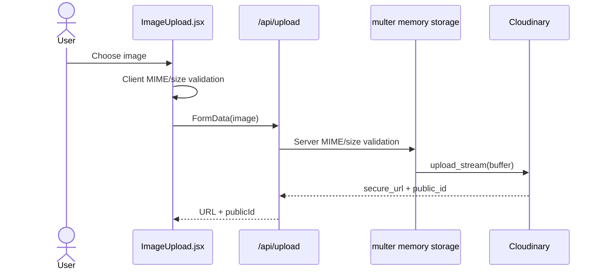

# Workoutly — Low-Level Design (LLD)

## 1. Document Information

| Field | Value |
| --- | --- |
| System | Workoutly |
| Repository | `garvitsingh171/workoutly` |
| Snapshot | `main` at `e9ea4d8751af48f6347f4a02c271bbecaf28baa2` |
| Review date | 22 August 2026 |
| Scope | Frontend routes/components/state, backend routes/middleware/controllers/services/models, data contracts, validations, flows and failure cases |

---

## 2. Repository Structure

```text
workoutly/
├── .github/workflows/ci.yml
├── client/
│   ├── public/
│   │   └── workoutly.png
│   ├── src/
│   │   ├── components/
│   │   │   ├── common/
│   │   │   ├── dashboard/
│   │   │   ├── ui/
│   │   │   └── workouts/
│   │   ├── context/
│   │   ├── pages/
│   │   ├── services/
│   │   ├── utils/
│   │   ├── App.jsx
│   │   └── main.jsx
│   ├── Dockerfile
│   ├── nginx.conf
│   ├── package.json
│   └── vercel.json
├── server/
│   ├── scripts/
│   ├── src/
│   │   ├── config/
│   │   ├── controllers/
│   │   ├── data/
│   │   ├── middleware/
│   │   ├── models/
│   │   ├── repositories/
│   │   ├── routes/
│   │   ├── services/
│   │   ├── utils/
│   │   └── validators/
│   ├── tests/
│   ├── app.js
│   ├── server.js
│   └── package.json
├── docs/
├── docker-compose.yml
├── docker-compose.prod.yml
└── package.json
```

---

## 3. Frontend Bootstrap and Provider Composition

`client/src/main.jsx` mounts the application.

`App.jsx` composes:

```text
BrowserRouter
  └── ThemeProvider
      └── AppContent
          └── AuthProvider
              ├── Toaster providers
              ├── Header
              ├── Routes
              └── Footer
```

`ThemeProvider` is above `AuthProvider` because app-level notification styling and document theme resolution can exist independently of authentication.

---

## 4. Frontend Route Design

| Route | Component | Guard | Main dependencies |
| --- | --- | --- | --- |
| `/` | `Home` | Public | Auth context |
| `/login` | `Login` | `PublicRoute` | Auth API |
| `/register` | `Register` | `PublicRoute` | User/auth API |
| `/dashboard` | `Dashboard` | `ProtectedRoute` | Profile, routines, summaries, goals, exercises |
| `/workouts/create` | `CreateWorkout` | `ProtectedRoute` | WorkoutBuilder, exercises, upload |
| `/workouts/edit/:id` | `EditWorkout` | `ProtectedRoute` | Workout API, WorkoutBuilder |
| `/workouts/session/:id` | `ActiveSession` | `ProtectedRoute` | Workout API, session API |
| `/progress` | `Progress` | `ProtectedRoute` | Session progress API |
| `/records` | `Records` | `ProtectedRoute` | Records API |
| `/history` | `History` | `ProtectedRoute` | Sessions, calendar, export |
| `/goals` | `Goals` | `ProtectedRoute` | Goal APIs |
| `/exercises` | `Exercises` | `ProtectedRoute` | Exercise API |
| `*` | `NotFound` | None | None |

### Route guard behavior

`ProtectedRoute`:

- waits while auth state is being restored,
- renders children when authenticated,
- redirects guests to login,
- preserves original navigation intent for redirect after login.

`PublicRoute`:

- permits guests,
- redirects authenticated users to dashboard.

Backend authorization is still mandatory because client-side route guards can be bypassed.

---

## 5. Frontend Authentication State

### AuthContext responsibilities

- Restore `token` and `user` from localStorage.
- Detect expired JWT state during restore.
- Expose authenticated user state.
- Perform login/logout coordination.
- React to API-layer auth-clear events.

### Axios behavior

The Axios client:

1. Uses the configured API base URL.
2. Reads the current access token.
3. Adds `Authorization: Bearer <token>` to protected requests.
4. Handles 401 responses.
5. Attempts refresh where applicable.
6. Retries the original request after successful refresh.
7. Clears authentication when refresh is no longer possible.

### Security consideration

Storing an access token in localStorage is simple but makes token theft possible if malicious JavaScript executes in the app. A production-hardening path would consider a fully HTTP-only cookie strategy or stronger XSS defenses.

---

## 6. Theme State

`ThemeContext` supports:

- `light`
- `dark`
- `system`

Preference is stored locally. `system` resolves through `prefers-color-scheme`. The resolved theme is applied to document-level attributes/CSS so components can use CSS custom properties consistently.

---

## 7. Workout Builder Design

`WorkoutBuilder.jsx` is the primary reusable form component for routine creation/editing.

### Conceptual workout form state

```js
{
  name,
  duration,
  difficulty,
  notes,
  exercises: [
    {
      name,
      sets,
      reps,
      restSeconds,
      notes
    }
  ]
}
```

### Responsibilities

- Initialize from blank or existing workout data.
- Add/remove exercise rows.
- Validate routine fields.
- Normalize values before submit.
- Show exercise suggestions.
- Display derived workout-plan summary.
- Expose create/edit behavior through callback props rather than duplicating forms.

### Validation intent

A workout must have:

- non-empty name,
- duration within valid range,
- valid difficulty,
- at least one exercise,
- each exercise with valid sets/reps/rest values.

The server repeats validation; client validation is primarily for UX.

---

## 8. Active Session Design

`ActiveSession.jsx` converts a workout template into mutable session state.

### Session state concept

```js
{
  workout,
  startedAt,
  exercises: [
    {
      name,
      sets: [
        {
          setNumber,
          targetReps,
          actualReps,
          weight,
          completed
        }
      ]
    }
  ]
}
```

### Completion logic

- User can record actual reps and weight.
- `completed` determines whether the set contributes to completed-set count and volume.
- Rest timer is UI state.
- Finish is not valid until at least one set is completed.
- Active state is not persisted before final save; refresh can lose the in-progress session.

---

## 9. History Page Design

`History.jsx` maintains independent state for:

- session list,
- applied filters,
- pagination,
- calendar month,
- selected date,
- selected-date sessions,
- list loading/error state,
- calendar loading/error state.

### Date design

Backend date filters use `YYYY-MM-DD` and UTC boundaries. Month aggregation uses `YYYY-MM` and UTC date keys. This gives deterministic API grouping but requires careful client-side timezone display testing.

---

## 10. Backend Startup

### `server/app.js`

Creates the Express app and installs:

1. CORS.
2. JSON body parsing.
3. Cookie parsing.
4. Health endpoint.
5. API route groups.
6. Not-found middleware.
7. Central error handler.

### `server/server.js`

Responsible for:

- loading environment variables,
- connecting to MongoDB,
- creating HTTP server,
- attaching Socket.IO,
- validating socket origin/authentication,
- listening on configured port.

Database startup failure exits the process rather than accepting requests without persistence.

---

## 11. Backend Route Inventory

### Authentication

Typical responsibilities under `/api/auth`:

- login,
- refresh,
- logout,
- registration-related auth behavior.

Rate limiting is applied to sensitive auth endpoints.

### Users

`/api/users` supports registration and protected own-profile operations.

### Workouts

`/api/workouts` supports user-owned routine CRUD and duplication.

### Sessions

`/api/sessions` provides:

- create session,
- paginated list,
- calendar aggregation,
- recent sessions,
- summary,
- exercise progress,
- CSV export.

### Goals

`/api/goals` manages weekly goal state and consistency summaries.

### Records

`/api/records` returns user personal records.

### Exercises

`/api/exercises` combines built-in exercises and custom user exercises.

### Upload

`/api/upload` accepts an authenticated image file and streams it to Cloudinary.

---

## 12. Middleware Design

| Middleware | Responsibility | Failure response |
| --- | --- | --- |
| CORS config | Allow trusted origins/credentials | Browser/API CORS rejection |
| `express.json` | Parse JSON | 400-style parse error through Express path |
| `cookie-parser` | Read refresh cookie | N/A |
| `protect` | Verify bearer access token and load user | 401 |
| express-validator chains | Validate request body/params | 400 |
| auth rate limiter | Reduce brute-force attempts | 429 |
| multer upload | Parse image, enforce size/type | 400 |
| `notFound` | Convert unmatched route into controlled error | 404 |
| `errorHandler` | Normalize thrown errors | Appropriate status / fallback 500 |

---

## 13. Data Models

## 13.1 User

Conceptually stores:

- name,
- normalized unique email,
- password hash,
- account timestamps.

Password is not stored in plaintext.

## 13.2 Workout

A workout is a reusable template.

```text
Workout
├── name: String, required, max 100
├── exercises[]
│   ├── name: String, required
│   ├── sets: Number, 1..20
│   ├── reps: Number, 1..100
│   ├── restSeconds: Number, 0..600, default 90
│   └── notes: String, max 240
├── duration: Number, 1..600
├── difficulty: beginner | intermediate | advanced
├── notes: String, max 500
├── coverImage: String/null
├── author: ObjectId -> User, required
├── createdAt
└── updatedAt
```

### Key invariant

Every workout has an owner (`author`) and at least one planned exercise.

---

## 13.3 WorkoutSession

A completed workout event.

```text
WorkoutSession
├── user: ObjectId -> User
├── workout: ObjectId -> Workout
├── workoutName: String snapshot
├── startedAt: Date
├── completedAt: Date
├── durationMinutes: Number >= 0
├── exercises[]
│   ├── name
│   └── sets[]
│       ├── setNumber >= 1
│       ├── targetReps
│       ├── actualReps
│       ├── weight
│       └── completed
├── totalCompletedSets
├── totalVolume
├── notes: max 500
├── createdAt
└── updatedAt
```

### Why `workoutName` is duplicated

It preserves a readable historical snapshot even if the workout template name changes later.

---

## 13.4 Exercise

Represents user-created exercise metadata. The UI/API also merges these with built-in exercise definitions in server data.

Expected concepts include:

- name,
- category,
- equipment,
- instructions/metadata,
- creator ownership for custom exercises.

---

## 13.5 Goal

Represents per-user weekly workout target.

Primary invariant: a user's target must remain within the server-accepted range.

---

## 13.6 PersonalRecord

Stores user-specific best performance derived from completed workout sessions. The record service evaluates a saved session and updates records where new best values occur.

---

## 14. Session Creation Algorithm

Server-side session creation performs the most important domain validation.

```text
Input request
  ↓
Validate workout ID
  ↓
Load workout
  ↓
404 if missing
  ↓
Compare workout.author with req.user._id
  ↓
403 if not owner
  ↓
Validate startedAt/completedAt
  ↓
Normalize exercises and sets
  ↓
For each completed set:
    completedSets += 1
    totalVolume += actualReps × weight
  ↓
Reject if completedSets == 0
  ↓
Create WorkoutSession
  ↓
Run personal record update
  ↓
Return session + any new records
```

### Normalization rules

- Numeric input is converted safely.
- Negative reps/weight are clamped to zero.
- Missing set number falls back to array position + 1.
- Only `completed === true` contributes to completed set count and volume.

---

## 15. History Query Algorithm

### Pagination

```text
page = positive integer or 1
requestedLimit = positive integer or 10
limit = min(requestedLimit, 50)
skip = (page - 1) * limit
```

### Filter

Always begins with:

```js
{ user: req.user._id }
```

Optional filters:

- `from` → `completedAt >= start-of-day UTC`
- `to` → `completedAt < next-day UTC`
- `workoutName` → escaped case-insensitive regex
- sort newest/oldest

The user ID is never taken from client query parameters for ownership.

---

## 16. Calendar Aggregation Algorithm

For a requested `YYYY-MM`:

1. Parse first day of month at UTC midnight.
2. Calculate first day of next month.
3. Query sessions for authenticated user inside range.
4. Convert each `completedAt` to `YYYY-MM-DD` UTC key.
5. Group by key.
6. Aggregate:
   - session count,
   - total volume,
   - total completed sets.

Response is an array of date summaries.

---

## 17. Exercise Progress Algorithm

Input: `exerciseName`.

1. Require non-empty exercise name.
2. Escape regex special characters.
3. Query authenticated user's sessions containing a matching exercise name.
4. For every session:
   - select matching exercises,
   - keep completed sets,
   - derive best weight,
   - derive best reps,
   - derive total volume,
   - count completed sets.
5. Return chronological progress entries.

This is simple and explainable but can become expensive as session history grows.

---

## 18. Streak Algorithm

The current streak calculation:

1. Convert session dates to a set of `YYYY-MM-DD` keys.
2. Start from today.
3. While the current date exists in the set, increment streak and move one day backward.
4. Stop at the first missing day.

Implication: if the user has no workout today, current streak becomes zero even if they trained yesterday. This is a product definition choice worth being able to explain.

---

## 19. CSV Export Design

CSV export returns rows at **set level**, not only session level.

Columns include:

```text
sessionId
workoutName
completedAt
durationMinutes
exerciseName
setNumber
targetReps
actualReps
weight
completed
totalVolume
```

Values are escaped for commas, quotes, and newlines. Response content type is `text/csv` with download disposition.

---

## 20. Workout Ownership Design

A critical backend rule:

```text
Requested workout
   ↓
Load from DB
   ↓
String(workout.author) === String(req.user._id) ?
   ├── yes → proceed
   └── no  → 403 Forbidden
```

This rule applies independently of whether the UI hides another user's ID. It prevents insecure direct object reference behavior for workout operations.

---

## 21. Authentication Details

### Registration

- Normalize email.
- Validate input.
- Check uniqueness.
- Hash password with bcrypt.
- Persist user.
- Generate token response according to auth flow.

### Login

- Find user including password hash.
- Compare supplied password using bcrypt.
- Issue JWT containing `userId`.

### Access token

Default expiry is configurable and falls back to the repository-defined value.

### Refresh token

- Uses a separate secret if configured.
- Stored client-side as a cookie by the auth flow.
- Not persisted in a server-side session/revocation table.

### Logout limitation

Clearing refresh cookie does not revoke an already issued access JWT before its expiry.

---

## 22. Image Upload Flow



### Current limitation

The routine primarily retains the image URL. Without persisted Cloudinary public ID lifecycle handling, replacing/deleting orphaned assets is harder.

---

## 23. Error Handling

### Controlled application errors

`AppError` carries message + HTTP status.

Examples:

- 400 invalid input.
- 401 missing/invalid authentication.
- 403 authenticated but not owner.
- 404 missing resource.
- 429 rate limit.
- 500 unexpected server failure.

### Client presentation

Pages combine:

- loading indicators,
- inline alert regions,
- toast notifications,
- disabled operations during submission,
- empty-state UI.

---

## 24. Validation Layers

Workoutly uses multiple validation layers:

```text
Client form validation
       ↓
Express route validation / manual controller validation
       ↓
Business ownership/invariant checks
       ↓
Mongoose schema validation
       ↓
MongoDB persistence
```

This redundancy is intentional: client validation improves UX, while backend and database validation protect integrity.

---

## 25. Testing Design

### Backend

The repository contains substantial authentication integration tests using Jest + Supertest. These test request/response behavior rather than only individual helper functions.

### Frontend

Testing Library/Jest configuration and selected tests exist, including header/login behavior, but coverage is smaller than backend coverage.

### Missing layer

No full browser E2E suite is present.

---

## 26. CI / Deployment Files

The repository includes:

- GitHub Actions CI workflow.
- Client and server Dockerfiles.
- Local and production-oriented Docker Compose files.
- Nginx client configuration.
- Vercel SPA configuration.
- Environment examples.
- Deployment variable documentation.

These demonstrate deployment awareness, while runtime production status should be verified separately from repository design.

---

## 27. Concurrency and Data Integrity Risks

### Session + records

Current flow:

```text
create WorkoutSession
then
update PersonalRecord(s)
```

Without a transaction, session creation can succeed while record updates fail. The user still has valid session history, but derived records can temporarily become inconsistent.

### Duplicate finish request

If the same finish request is submitted twice, there is no idempotency key or unique session constraint guaranteeing only one session record.

### Improvement

For higher production rigor:

- add idempotency key to session completion,
- use MongoDB transaction when session + record updates must be atomic,
- or make record rebuilding deterministic from sessions so records can be repaired.

---

## 28. Database Index Recommendations

As the dataset grows, consider:

```text
Workout:        { author: 1, updatedAt: -1 }
WorkoutSession: { user: 1, completedAt: -1 }
Goal:           { user: 1 } unique if one current goal document per user
PersonalRecord: { user: 1, exerciseName: 1, recordType: 1 }
Exercise:       { createdBy: 1, name: 1 }
```

Exact indexes should follow actual query plans and model constraints rather than being added blindly.

---

## 29. Performance Hotspots

- Dashboard fetch fan-out.
- Full-history summary calculations.
- Exercise progress through embedded session arrays.
- Calendar grouping in Node.js.
- No client route code splitting.
- No cache.
- No background job system.

These are acceptable for current project scale but should be acknowledged rather than presented as infinitely scalable.

---

## 30. Security Review Summary

### Implemented strengths

- Password hashing with bcrypt.
- JWT verification.
- Backend ownership authorization.
- CORS allowlist behavior.
- Auth rate limiting.
- Upload MIME/size restrictions.
- Centralized error handling.
- Mongoose validation.

### Hardening opportunities

- Add secure HTTP headers.
- Reduce localStorage token exposure.
- Add stronger refresh-token lifecycle/revocation.
- Audit dependencies automatically.
- Add broader sanitization/validation consistency.
- Add upload lifecycle cleanup and potentially malware/content scanning for larger production scope.
- Avoid sensitive production logging.

---

## 31. Design Decisions To Defend In Interview

### Why MongoDB?

Workout templates and workout sessions naturally contain nested exercise/set arrays. MongoDB/Mongoose maps these document shapes conveniently and keeps a session event together as one document.

### Why embed session sets instead of normalizing every set into its own collection?

Sets belong strongly to one workout session and are normally read together. Embedding reduces joins/lookups and matches the aggregate boundary. At very large analytics scale, a different data model could be considered.

### Why separate Workout and WorkoutSession?

A Workout is a mutable plan. A WorkoutSession is historical fact. Combining them would make edits to future plans interfere with the representation of past execution.

### Why React Context instead of Redux?

Only auth and theme are truly global. Most server state is page-scoped, so introducing a larger state-management dependency would add complexity without proportional benefit at current scale.

### Why not microservices?

The product scope is small and domain boundaries are not operationally large enough to justify distributed systems overhead. A modular monolith is easier to develop, deploy, test, and explain.

### Why JWT?

JWT keeps protected API authentication stateless and simple. The tradeoff is revocation complexity, which the current implementation accepts at portfolio scale.

---

## 32. Known Gaps / Technical Debt

- Controller-heavy logic for sessions/goals/exercises.
- No transaction for session + record update.
- No idempotency key for session completion.
- Limited frontend automated tests.
- No E2E browser suite.
- Socket.IO present without a strong domain use case.
- Active session draft lost on refresh.
- Profile management UI incomplete.
- Custom exercise update/delete missing.
- Cloudinary deletion lifecycle incomplete.
- No full metrics/tracing/log aggregation stack.

---

## 33. Final Request-to-Data Trace Example

**Use case:** user finishes a workout.

```text
ActiveSession.jsx
  ↓ POST /api/sessions with Bearer token
Axios request interceptor
  ↓
Express route
  ↓ protect middleware
verify JWT + load User
  ↓
sessionController.createSession
  ↓
Workout.findById
  ↓
ownership check
  ↓
normalize exercise set logs
  ↓
WorkoutSession.create
  ↓
recordService.updatePersonalRecordsForSession
  ↓
MongoDB
  ↓
sendSuccess(201, session, newRecords)
  ↓
Axios response
  ↓
React navigation/toast/history becomes available
```

This trace is the best single flow to use in an interview because it connects frontend state, HTTP, authentication, authorization, business logic, schema design, derived calculations, persistence, and response handling.
