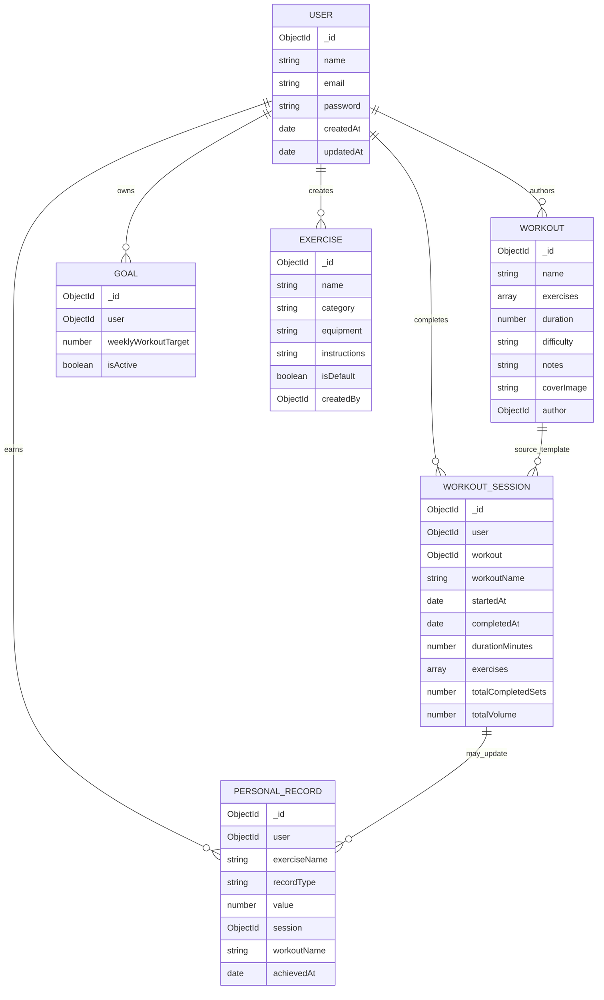

# Database Design

## Overview

Workoutly uses MongoDB with Mongoose. `server/src/config/db.js` connects using `MONGO_URI`, or test-specific `MONGO_URI_TEST`/`MONGODB_URI_TEST` when `NODE_ENV=test`. MongoDB fits the current project because routines and completed sessions naturally contain embedded exercise and set arrays.

## Entity Inventory

| Model | Purpose | Important fields | Required | Defaults/enums | References | Indexes | Timestamps | Ownership |
| --- | --- | --- | --- | --- | --- | --- | --- | --- |
| `User` | Account identity | `name`, `email`, `password` | All | email lowercase; password `select:false`; password min 6 | None | `email` unique/index | Yes | Owns other data by `_id` |
| `Workout` | Reusable routine template | `name`, `exercises`, `duration`, `difficulty`, `notes`, `coverImage`, `author` | name, duration, author, at least one exercise | difficulty `beginner/intermediate/advanced`, rest default 90 | `author -> User` | No explicit author index found | Yes | `author` |
| `WorkoutSession` | Completed workout log | `user`, `workout`, `workoutName`, `startedAt`, `completedAt`, `durationMinutes`, embedded exercises/sets, totals, notes | user, workout, workoutName, dates, duration | set defaults for reps/weight/completed/totals | `user -> User`, `workout -> Workout` | No explicit indexes found | Yes | `user` |
| `Exercise` | Default or custom exercise library item | `name`, `category`, `equipment`, `instructions`, `isDefault`, `createdBy` | name | category/equipment enums; `isDefault:true`; `createdBy:null` | `createdBy -> User` | unique partial indexes for default name and custom name+createdBy | Yes | Defaults public; custom by `createdBy` |
| `Goal` | Weekly workout target | `user`, `weeklyWorkoutTarget`, `isActive` | user, weekly target | weekly target default 3, min 1 max 14; active default true | `user -> User` | `user` index | Yes | `user` |
| `PersonalRecord` | Best exercise records | `user`, `exerciseName`, `recordType`, `value`, `session`, `workoutName`, `achievedAt` | user, exerciseName, recordType, value | recordType enum `max_weight/max_reps/max_volume`; value min 0 | `user -> User`, `session -> WorkoutSession` | unique `user + exerciseName + recordType` | Yes | `user` |

## ER Diagram

## Relationships And Ownership

Users are the ownership root. Workouts use `author`; sessions, goals, and records use `user`; custom exercises use `createdBy`. Default exercises are visible to all users through the in-memory `defaultExercises` list and optionally persisted `Exercise` documents with `isDefault:true`.

Workout sessions reference the workout template and also store `workoutName`. That snapshot helps history remain readable if the routine is later renamed or deleted, although the raw `workout` reference can become orphaned.

## Embedded Versus Referenced Data

Workout templates embed exercise plan rows because exercises are part of the routine shape. Completed sessions embed set logs because they are historical facts for that session. Users, workouts, sessions, goals, records, and exercise library entries are top-level documents because they are queried independently.

## Data Lifecycle

| Data | Create | Update | Delete | Risk |
| --- | --- | --- | --- | --- |
| User | Register | Profile API | Profile API | Deleting user does not cascade owned workouts/sessions/goals/records in `userService.deleteUser`. |
| Workout | Create builder/API | Edit builder/API | Dashboard/API | Deleting routine does not delete session history. |
| WorkoutSession | Finish active session | No update endpoint found | No delete endpoint found | Duplicate session saves possible. |
| Goal | Default object if absent; upsert on update | Goals page/API | No delete endpoint found | Multiple active goals possible if inserted externally. |
| PersonalRecord | Created/updated after sessions | Updated only when new value is higher | No delete endpoint found | Session deletion is absent, so records do not recalculate downward. |
| Exercise | Defaults in memory or seed; custom create API | No update endpoint found | No delete endpoint found | Custom exercise names cannot be corrected through UI/API. |

## Query Patterns

| Use case | Query pattern | Source |
| --- | --- | --- |
| Dashboard routines | `Workout.find({ author }).sort({ createdAt:-1 }).skip().limit()` | `workoutRepository.js` |
| Dashboard session stats | `WorkoutSession.find({ user }).sort({ completedAt:-1 })` | `sessionController.js` |
| History list | `WorkoutSession.find({ user, completedAt range, workoutName regex }).sort().skip().limit()` | `sessionController.js` |
| Calendar | `WorkoutSession.find({ user, completedAt month range }).sort({ completedAt:1 })` | `getSessionCalendar` |
| Progress | `WorkoutSession.find({ user, 'exercises.name': regex }).sort({ completedAt:1 })` | `getExerciseProgress` |
| Goals | `Goal.findOne({ user, isActive:true }).sort({ createdAt:-1 })` | `goalController.js` |
| Records | `PersonalRecord.find({ user })` or by exercise name regex | `recordController.js` |

## Indexing

Implemented indexes:

- `User.email` unique/index.
- `Exercise` unique partial index `{ name, isDefault }` for defaults.
- `Exercise` unique partial index `{ name, createdBy }` for custom exercises.
- `Goal.user` index.
- `PersonalRecord` unique `{ user, exerciseName, recordType }`.

Recommended but not implemented:

- `Workout.author + createdAt` for dashboard pagination.
- `WorkoutSession.user + completedAt` for history/calendar/dashboard summaries.
- `WorkoutSession.user + workoutName` if workout-name filtering becomes common.

## Data-Integrity Risks

- No transactions for session creation plus record updates.
- No duplicate-session idempotency key.
- Deleting users or workouts can leave related documents unless handled externally.
- Session dates use JavaScript dates and UTC keys in some controllers; timezone expectations should be tested.
- Workout/session embedded arrays could become large.
- Records store one current best value per exercise/type, not a full record history.

## Seed Data

`server/scripts/seedDemo.js` creates guarded demo users, routines, sessions, goals, and records around `SEED_BASE_DATE` or the current date. It refuses unsafe environments unless an explicit production override is provided. `server/scripts/seedExercises.js` persists the default exercise library. The API also merges in-memory `defaultExercises`, so defaults are available even before exercise seeding.

See [Demo Seeding](../DEMO_SEEDING.md).

