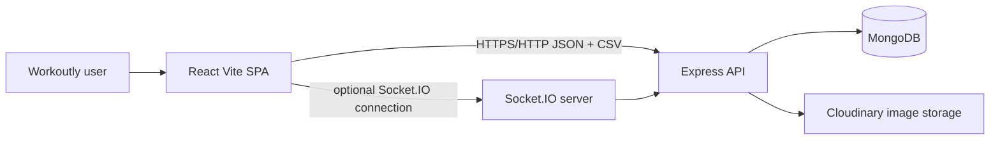
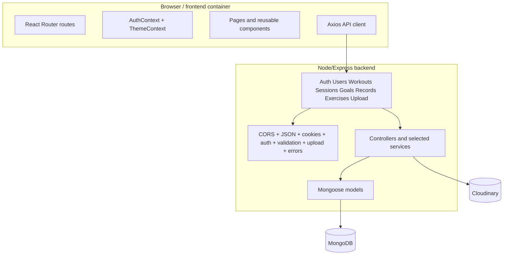
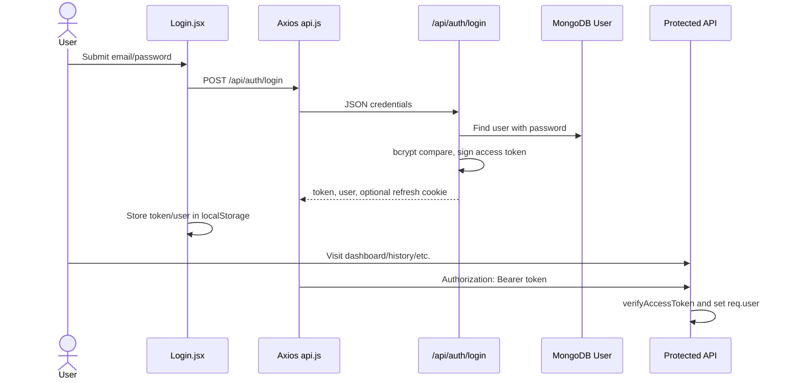
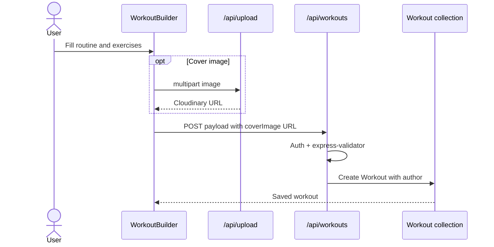
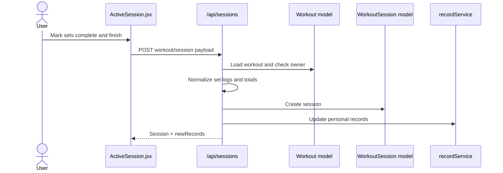
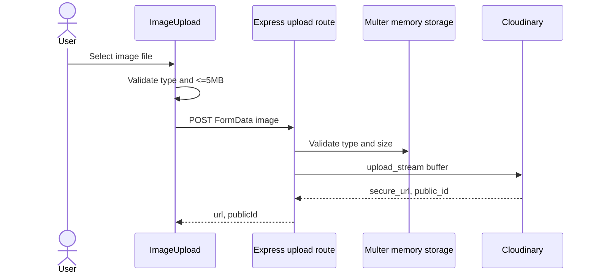
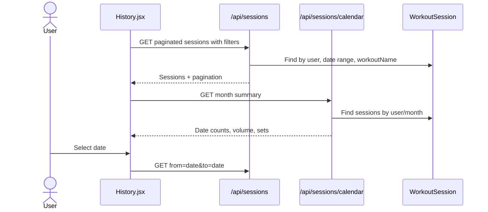
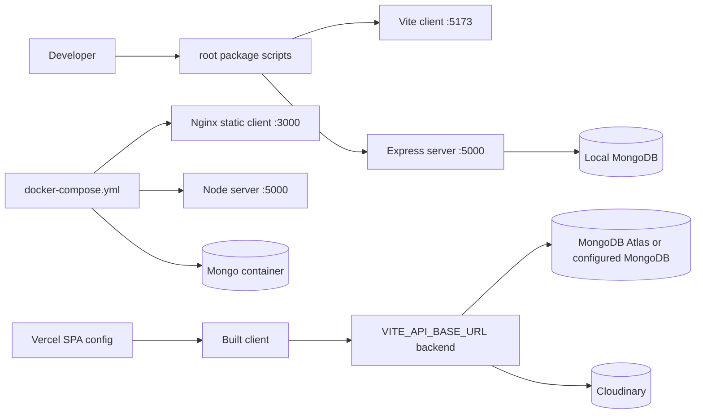

# High-Level Design

## System Overview

Workoutly is a browser-based workout tracker. A user registers or logs in, manages workout templates, starts a manual workout session, saves completed set data, and reviews derived summaries such as history, calendar activity, goals, streaks, progress, and personal records.

High-level flow:

```text
User action -> React route/component -> Axios API client -> Express route -> middleware -> controller/service -> Mongoose model -> MongoDB -> JSON response -> React state/UI
```

## Technology Stack

| Layer | Technology | Evidence | Why it is used in Workoutly |
| --- | --- | --- | --- |
| Frontend framework | React 19 + Vite | `client/package.json`, `client/src/main.jsx` | Component UI and fast development server/build. |
| Styling | CSS modules-by-convention with global CSS variables | `index.css`, `App.css`, `ui.css` | Themeable design tokens, responsive layouts, reusable UI primitives. |
| Routing | React Router 7 | `App.jsx` | Public/protected routes and SPA navigation. |
| State management | React Context + local component state | `AuthContext.jsx`, `ThemeContext.jsx` | Auth/theme are global; page data remains local. |
| HTTP client | Axios | `services/api.js` | Base URL, bearer token interceptor, 401 refresh handling. |
| Realtime infrastructure | Socket.IO | `server.js`, `services/socket.js`, `Dashboard.jsx` | Authenticated socket connection exists; no domain events confirmed. |
| Backend runtime | Node.js | `server/package.json` | Express API runtime. |
| Backend framework | Express 5 | `server/app.js` | Route groups, middleware, JSON API. |
| Database | MongoDB | `db.js`, compose files | Document storage for user-owned workout data. |
| ODM | Mongoose | `server/src/models/*.js` | Schemas, validation, indexes, relationships. |
| Authentication | JWT + bcrypt + optional refresh cookie | `authService.js`, `token.js`, `authController.js` | Password auth, bearer-protected APIs, refresh support. |
| Image storage | Cloudinary + multer memory upload | `cloudinary.js`, `upload.js`, `middleware/upload.js` | Stores routine cover images externally and keeps URL in MongoDB. |
| Deployment | Docker, Nginx, Vercel config | `Dockerfile`s, `docker-compose*.yml`, `client/vercel.json` | Local/prod containers and SPA fallback. |
| Testing | Jest, Supertest, Testing Library | `server/tests/auth.test.js`, client tests | Backend integration and limited frontend component coverage. |

## System Context Diagram



## Container Diagram



## Major Application Modules

| Module | Responsibility | Main files | Data consumed/produced | Dependencies | Security boundary | Limitations |
| --- | --- | --- | --- | --- | --- | --- |
| Authentication | Register, login, refresh, logout, route protection | `AuthContext.jsx`, `api.js`, `authController.js`, `authService.js`, `auth.js` | User profile and JWTs | bcrypt, JWT, cookies | Bearer token and own-profile checks | Access token stored in localStorage. |
| User profile | Fetch/update/delete own user | `Dashboard.jsx`, `userController.js`, `userService.js` | `User` documents | Auth middleware | Only current user ID allowed | Update/delete UI not confirmed. |
| Routines | Workout template CRUD and duplicate | `WorkoutBuilder.jsx`, `Dashboard.jsx`, `workoutService.js`, `Workout.js` | `Workout` documents | Auth, validators | `Workout.author` ownership | Delete does not cascade sessions. |
| Active session | Manual set completion | `ActiveSession.jsx`, `sessionController.js`, `WorkoutSession.js` | Session logs and records | Workout ownership, record service | Session user and workout owner | No duplicate guard, no draft persistence. |
| History/calendar | List, filter, group, export sessions | `History.jsx`, session endpoints | `WorkoutSession` | Auth | Query filters include current user | Calendar uses UTC date keys. |
| Goals/streaks | Weekly target and consistency summaries | `Goals.jsx`, `goalController.js`, `Goal.js` | `Goal`, `WorkoutSession` | Auth | User-owned goals/sessions | Streaks derived, not stored. |
| Records/progress | Personal records and exercise progress | `Records.jsx`, `Progress.jsx`, `recordService.js`, `PersonalRecord.js` | `PersonalRecord`, session exercise sets | Session save | User-owned queries | Progress requires exercise name search. |
| Exercise library | Default and custom movements | `Exercises.jsx`, `WorkoutBuilder.jsx`, `exerciseController.js`, `defaultExercises.js`, `Exercise.js` | Exercise metadata | Auth | Defaults plus current user's custom exercises | No edit/delete endpoints. |
| Image upload | Upload routine cover images | `ImageUpload.jsx`, `upload.js`, `cloudinary.js` | File buffer -> Cloudinary URL | multer, Cloudinary | Protected endpoint | Public ID not stored on routine. |
| Theme | Light/dark/system UI preference | `ThemeContext.jsx`, `ThemeToggle.jsx`, `index.css` | Local preference | `localStorage`, `matchMedia` | Client-only | Not synced to account. |
| Seed data | Demo and default exercise data | `seedDemo.js`, `seedExercises.js` | Demo users/routines/sessions/goals/records | Mongoose | Guarded env checks | Scripts not run by app startup. |

## Major Data Flows

### Login And Authenticated Request



### Routine Creation



### Workout Completion



### Exercise Image Upload



### Calendar And History



## Authentication And Authorization Architecture

Identity is established with email/password login. Passwords are hashed with bcrypt before storage. Access tokens are signed JWTs with a `userId` payload. The frontend stores `token` and `user` in `localStorage`, decodes JWT expiry during session restoration, and attaches the token in the Axios request interceptor. When protected requests receive a 401, Axios attempts `POST /api/auth/refresh`; if it succeeds, it stores the new token/user and retries the original request.

The backend `protect` middleware reads `Authorization: Bearer <token>`, verifies it, loads the user without the password field, and assigns `req.user`. Ownership is enforced in service/controller logic: workouts compare `Workout.author`, sessions filter by `WorkoutSession.user`, profile routes require requested ID to equal current user ID, goals query by `user`, and records query by `user`.

Security limitations include localStorage token exposure risk, no server-side refresh-token persistence/revocation list, no helmet-style secure headers, and mixed validation depth across route groups.

## Data Architecture

Main entities are `User`, `Workout`, `WorkoutSession`, `Exercise`, `Goal`, and `PersonalRecord`. Users own workouts, sessions, custom exercises, goals, and records. Sessions reference a workout and store a snapshot `workoutName`, embedded exercise logs, totals, and timestamps. Workout templates embed exercise plan rows. See [DATABASE_DESIGN.md](DATABASE_DESIGN.md).

## API Architecture

The API is REST-like JSON under `/api/*`, with a health endpoint and CSV export endpoint. Route groups register in `server/app.js`, controllers forward errors to centralized `errorHandler`, `sendSuccess` creates success response envelopes, and selected routes use `express-validator`. See [API_REFERENCE.md](API_REFERENCE.md).

## Deployment Architecture



Production platform details are configured but not confirmed from external dashboards. See [DEPLOYMENT_AND_OPERATIONS.md](../engineering/DEPLOYMENT_AND_OPERATIONS.md).

## Security Architecture

Trust boundaries include browser storage, API requests, MongoDB, and Cloudinary. Current protections include auth middleware, bcrypt passwords, auth rate limiting, CORS allowlist, file type/size checks, Mongoose validation, ownership filters, and centralized error responses. Gaps include secure headers, broader input sanitization, upload scanning, public ID cleanup, and localStorage token risk. See [SECURITY.md](../engineering/SECURITY.md).

## Reliability And Error Handling

Frontend pages render loading spinners, inline alerts, empty states, disabled buttons, and toast messages. Backend errors are normalized through `AppError`, Mongoose error handling, duplicate key handling, and a final generic 500 response. Database connection failure exits process startup. Cloudinary upload failures return 500 with upload error message. There is no retry queue, background job system, or transaction handling.

## Scalability Considerations

Current implementation is appropriate for a learning/portfolio scale. Future concerns include unbounded session history, progress queries over all sessions, dashboard fan-out across several endpoints, image storage cleanup, missing indexes on `WorkoutSession.user/completedAt`, and lack of caching. Backend is mostly stateless except for Socket.IO connections and MongoDB/Cloudinary dependencies.

## Technical Tradeoffs

| Tradeoff | Current choice | Benefit | Cost |
| --- | --- | --- | --- |
| Context API vs Redux | Context for auth/theme, local page state | Simple and sufficient | Server state duplicated in pages |
| MongoDB embedded arrays | Workout exercises and session set logs embedded | Natural shape for routines/sessions | Large arrays could become heavy |
| Manual completion | User marks sets | Honest and flexible | No automation or sensor integration |
| Client-side calculations | Dashboard/history derive some labels and display summaries | Responsive UI iteration | Potential duplicate logic |
| Image URL storage | Store `coverImage` URL only | Simple schema | Harder Cloudinary cleanup |
| Single backend | One Express app | Easy deployment and development | Mixed module boundaries as features grow |

## Known Technical Debt

- Mixed controller/service patterns.
- No transaction around session creation and record updates.
- No duplicate-session/idempotency protection.
- Limited frontend tests and no E2E tests.
- Upload route lacks automated tests and advanced scanning.
- Socket.IO infrastructure is underused.
- Profile update/delete lacks confirmed UI.
- Stale template files/assets remain in the client.

