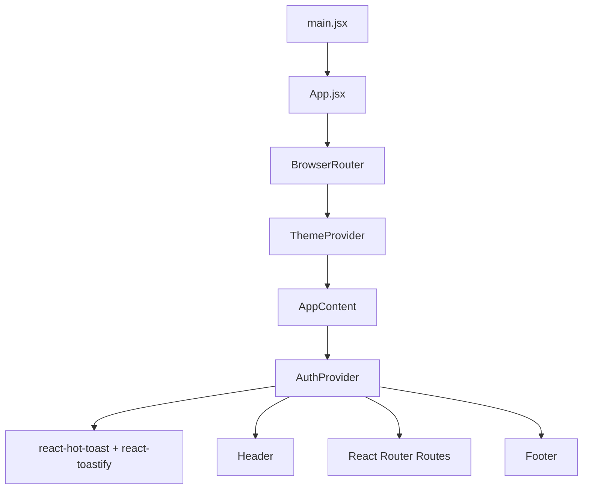
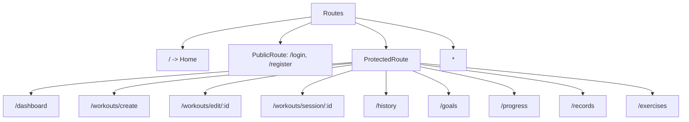
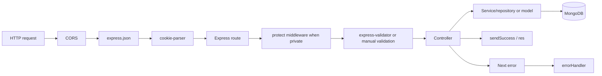

# Low-Level Design

This document combines the frontend and backend low-level design for Workoutly. It was verified from the repository on August 5, 2026; runtime behavior and external deployments were not executed during this documentation task.

## Frontend Entry And Initialization

`client/src/main.jsx` mounts `<App />` into `#root` inside React `StrictMode`. `App.jsx` creates the router and wraps the app with `ThemeProvider`. `AppContent` reads `resolvedTheme`, wraps children with `AuthProvider`, renders toast providers, header, routes, and footer. Global CSS enters through `main.jsx`, `App.jsx`, and component UI imports.



## Frontend Folder Structure

```text
client/src/
├── App.jsx, main.jsx, App.css, index.css
├── components/
│   ├── common/        ProtectedRoute, PublicRoute, LoadingSpinner, ThemeToggle, unused ConnectionTest
│   ├── dashboard/     ProgressInsights, AchievementSection
│   ├── ui/            Button, Card, Input, Badge, shared ui.css
│   └── workouts/      WorkoutBuilder
├── context/           AuthContext, ThemeContext
├── pages/             Home, auth, dashboard, builder, session, history, goals, progress, records, exercises, 404
├── services/          Axios API client and Socket.IO client
└── utils/             Workout builder serialization and validation
```

## Frontend Route Architecture



| Path | Component | Access | Data requirements | Redirect/loading/error/empty behavior | Mobile behavior |
| --- | --- | --- | --- | --- | --- |
| `/` | `Home` | Public | Auth context | Redirects authenticated users to dashboard; shows loading during auth restore | Hero stacks |
| `/login` | `Login` | PublicRoute | `/api/auth/login` | Redirects authenticated users; client validation and API alerts | Centered panel |
| `/register` | `Register` | PublicRoute | `/api/users/register` | Client validation, success delay then login redirect | Centered panel |
| `/dashboard` | `Dashboard` | Protected | profile, workouts, session summary, goals, recent, calendar, exercises | Multiple loading/error/empty sections | Grids collapse |
| `/workouts/create` | `CreateWorkout` | Protected | exercises, upload, workouts | Builder validation, upload and submit states | Rail stacks |
| `/workouts/edit/:id` | `EditWorkout` | Protected | workout by ID, exercises | Loading page; error back action | Rail stacks |
| `/workouts/session/:id` | `ActiveSession` | Protected | workout by ID, sessions | Redirects on load failure; finish disabled until set complete | Compact set grid and sticky finish bar |
| `/history` | `History` | Protected | sessions, calendar, export | List/calendar/selected-date loading; filter empty states | Calendar horizontally scrolls |
| `/goals` | `Goals` | Protected | goals summary/current | Loading, validation, success/error alerts | Form stacks |
| `/progress` | `Progress` | Protected | progress endpoint | Search-driven empty/loading/error | Table wrapper scrolls |
| `/records` | `Records` | Protected | records endpoint | Loading/error/no-records | Card grid collapses |
| `/exercises` | `Exercises` | Protected | exercises endpoint | Loading/error/no-results | Library columns stack |
| `*` | `NotFound` | Public | None | 404 message | Simple layout |

## Frontend Component Architecture

| Group | Components | Responsibility |
| --- | --- | --- |
| Layout/navigation | `Header`, `Footer`, `ProtectedRoute`, `PublicRoute` | App shell, auth-aware nav, route guards |
| Forms | `Login`, `Register`, `WorkoutBuilder`, `ImageUpload`, `Goals`, `Exercises` | Controlled inputs, validation, disabled submit states, errors |
| Workout/routine | `WorkoutBuilder`, `CreateWorkout`, `EditWorkout`, dashboard routine cards | Build, save, edit, duplicate, delete, and start templates |
| Session/history/calendar | `ActiveSession`, `History` | Manual set logs, rest timer, session save, filters, custom calendar |
| Dashboard | `Dashboard`, `ProgressInsights`, `AchievementSection` | Stats, summaries, chart-like bars, achievements |
| Reusable UI | `Button`, `Input`, `Card`, `Badge`, `LoadingSpinner` | Consistent styling and basic accessibility |
| Feedback | Toast providers, alerts, empty states | User-visible success/error/loading states |

Important component details:

- `WorkoutBuilder` receives `initialData`, submit labels, `onSubmit`, `onCancel`, and optional `coverSlot`. It owns form state, validation errors, exercise suggestions, and derived plan summary.
- `ActiveSession` owns `sessionData`, rest timer state, save state, and `startedAtRef`.
- `History` owns filters, applied filters, pagination, selected date state, calendar month, and separate loading/error states.

## Frontend State Management

| State | Owner | Persistence | Consumers | Risks |
| --- | --- | --- | --- | --- |
| Auth user/token | `AuthContext` | `localStorage` | Routes, header, API client indirectly | localStorage XSS risk; duplicated expiry logic client-side |
| Theme | `ThemeContext` | `localStorage` | App shell, toggle, CSS data attributes | Preference not synced to backend |
| Server data | Individual pages | Memory only | Page components | Repeated fetches and stale data after navigation |
| Routine form | `WorkoutBuilder` | Memory until submit | Builder children | Lost on refresh |
| Active session logs | `ActiveSession` | Memory until finish | Session UI | Lost on refresh; no draft persistence |
| History calendar selection | `History` | Memory | History UI | UTC/local date expectations need testing |
| Derived dashboard stats | `Dashboard`, child components | Memory | Dashboard UI | Duplicate calculations between frontend/backend |

## Frontend Data-Fetching Lifecycle

```text
User action
-> page/component handler or effect
-> Axios instance in services/api.js
-> request interceptor adds bearer token
-> backend endpoint
-> response/error interceptor may refresh on protected 401
-> page sets state
-> loading/error/empty/success UI updates
```

Most pages set a `loading` boolean before the request, store a message from `getErrorMessage`, and show `toast.error` plus inline alerts for important failures.

## Frontend Forms And Validation

| Form | Fields | Client validation | Server validation | Submit success |
| --- | --- | --- | --- | --- |
| Login | email, password | required | `loginValidator` email/password | Store auth, navigate dashboard/original route |
| Register | name, email, password, confirm | required, length, email, match | `registerValidator`, Mongoose, duplicate email | Clear form, toast, delayed login redirect |
| Workout builder | name, duration, difficulty, notes, exercise rows | `validateWorkoutForm` | `workoutValidator`, Mongoose | Create/update and navigate dashboard |
| Image upload | file | MIME and <=5MB | Multer MIME and <=5MB | Store returned URL in create flow |
| Goals | weekly target | integer 1-14 | manual server validation | Refetch summary |
| Exercise library | name, category, equipment, instructions | name required | manual duplicate/name/category/equipment normalization | Add to list |

## Frontend Authentication UI Flow

Login stores `token` and `user` through `AuthContext.login`. On app load, `AuthProvider` restores both from `localStorage`, rejects expired tokens based on JWT `exp`, and clears auth on a custom `workoutly-auth-cleared` event from the Axios interceptor. `ProtectedRoute` renders a loading spinner while auth restores and redirects guests to `/login` with the original location in state. `PublicRoute` redirects authenticated users to `/dashboard`.

## Frontend Theme System

Themes are `light`, `dark`, and `system`. Preference is stored under `workoutly-theme-preference`; resolved theme is written to `document.documentElement.dataset.theme` and `colorScheme`. System mode listens to `prefers-color-scheme`. Because initialization happens in React, a flash of the default theme is possible before React mounts.

## Frontend Calendar And History

`History.jsx` builds a custom UTC month grid using `type="month"` and `type="date"` inputs. It fetches month summaries from `/api/sessions/calendar?month=YYYY-MM`, uses button cells with `aria-label` and `aria-pressed`, and fetches selected-day sessions by calling `/api/sessions?from=date&to=date&limit=50`. Dates are formatted with a mixture of local display and UTC date keys; timezone behavior should be manually tested.

## Frontend Image Handling

`ImageUpload` validates selected file type/size, creates an object URL preview, and sends `FormData` with field `image`. `CreateWorkout` waits for upload completion and then sends the returned URL as `coverImage` in the workout payload. `EditWorkout` preserves existing cover image but does not expose a new upload slot. There is no progress percentage; state is boolean uploading/submitting.

## Frontend Responsive Design

`App.css` uses breakpoints at `1100px`, `980px`, `720px`, and `520px`. Header actions wrap, authenticated nav remains horizontally scrollable, dashboard grids move from multi-column to one column, builder rail becomes normal flow, library/history layouts stack, history calendar gets a minimum width with horizontal scroll, active-session inputs shrink, and the finish bar respects safe-area inset.

## Frontend Accessibility

Strengths: labelled inputs, `aria-invalid`, `role="alert"` for field errors, `role="status"`/`aria-live` for loading/rest states, focus-visible rings, screen-reader labels for active-session inputs, calendar button labels, and reduced-motion CSS.

Gaps: no automated accessibility tests, no formal dialog focus management because browser `confirm` is used, no documented contrast audit, table responsiveness relies on scrolling, and the theme toggle uses text initials rather than icons.

## Frontend Performance

Potential hotspots include dashboard fan-out requests, all-session summary scans, progress queries over embedded arrays, history/calendar repeated fetches, large tables/lists without virtualization, and no route-level code splitting. Implemented optimizations include server-side pagination for workouts/history, backend limit cap at 50, and `useMemo` for derived dashboard/history values.

## Backend Initialization

`server/server.js` loads environment variables, imports `app`, connects to MongoDB, wraps the Express app in an HTTP server, creates a Socket.IO server with CORS origin checks, authenticates socket handshakes with JWT, and listens on `PORT || 5000`.

`server/app.js` creates the Express app, initializes a no-op `app.locals.io` for tests/imports, applies CORS, JSON parsing, and cookies, registers route groups, then attaches `notFound` and `errorHandler`.

Startup database failure logs the error and exits via `process.exit(1)` in `db.js`.

## Backend Folder Structure

```text
server/
├── app.js, server.js
├── scripts/                  seedDemo.js, seedExercises.js
└── src/
    ├── config/               db, cors, cloudinary
    ├── controllers/          route handlers
    ├── data/                 defaultExercises
    ├── middleware/           auth, errors, upload, rate limit
    ├── models/               Mongoose models
    ├── repositories/         user/workout data access helpers
    ├── routes/               Express route groups
    ├── services/             auth, user, workout, records
    ├── utils/                AppError, apiResponse, token
    └── validators/           express-validator chains
```

## Backend Request Lifecycle



## Backend Route Inventory

| Base path | Purpose | Auth | Controller | Validation | Models | Ownership | Error behavior |
| --- | --- | --- | --- | --- | --- | --- | --- |
| `/api/auth` | register/login/refresh/logout | Public; rate-limited auth endpoints | `authController` | `authValidators` for register/login | `User` | Not applicable | `AppError` to centralized handler |
| `/api/users` | register and own profile get/update/delete | register public; profile protected | `userController` | register/user id/update validators | `User` | requested id equals current user | 403 for other user |
| `/api/workouts` | routine CRUD/duplicate | Protected | `workoutController` | `workoutValidators` | `Workout` | `author` equals current user | 403 for other user |
| `/api/sessions` | session save/history/calendar/export/progress/summary | Protected | `sessionController` | Manual validation | `Workout`, `WorkoutSession`, `PersonalRecord` | `user` filter and workout owner check | 400/403/404 via `AppError` |
| `/api/goals` | current goal and summaries | Protected | `goalController` | Manual target validation | `Goal`, `WorkoutSession` | `user` filter | 400 for invalid target |
| `/api/records` | personal records | Protected | `recordController` | None beyond auth | `PersonalRecord` | `user` filter | centralized errors |
| `/api/exercises` | exercise library | Protected | `exerciseController` | Manual validation | `Exercise`, default data | default or `createdBy` current user | duplicate/name errors |
| `/api/upload` | image upload | Protected | inline route handler | multer filter/limits | None directly | current user must be authenticated | route-local upload errors |

## Backend Controller And Service Design

Controllers extract request data, call services/models, and shape responses through `sendSuccess`. `auth`, `user`, `workout`, and `record` logic have service/repository support. `sessionController`, `goalController`, and `exerciseController` contain more business logic directly: date parsing, streak calculation, filtering, normalization, duplicate checks, CSV generation, and progress aggregation.

## Backend Middleware

| Middleware | Input | Mutation/output | Failure | Security purpose | Source |
| --- | --- | --- | --- | --- | --- |
| CORS | Origin header | Allows configured/local origins with credentials | CORS error | Browser origin boundary | `config/cors.js` |
| JSON parser | JSON body | `req.body` | parse error | Structured input | `app.js` |
| Cookie parser | Cookie header | `req.cookies` | none | Refresh cookie access | `app.js` |
| `protect` | Bearer token | `req.user` | 401 | API authentication | `middleware/auth.js` |
| validators | body/params | sanitized/validated fields | 400 first error | Input validation | `validators/*.js` |
| `authLimiter` | Auth route requests | rate-limit response | 429 | Brute-force reduction | `rateLimiters.js` |
| upload | multipart file | `req.file` buffer | 400 | File type/size control | `middleware/upload.js` |
| `notFound` | unmatched route | 404 AppError | 404 | clear route failure | `errorHandler.js` |
| `errorHandler` | thrown/forwarded errors | normalized JSON | status-specific | no stack exposure | `errorHandler.js` |

## Backend Authentication

Registration normalizes email, checks duplicates, hashes password with bcrypt salt rounds 10, creates a user, and returns an access token. Login finds the user with password selected, compares password, returns access token and optional refresh token. Access tokens use payload `{ userId }` and `JWT_EXPIRE || '7d'`; refresh tokens require `JWT_REFRESH_SECRET` and use `JWT_REFRESH_EXPIRE || '7d'`.

Logout clears the refresh cookie but cannot revoke already issued access tokens. Refresh tokens are signed but not stored server-side, so logout is cookie cleanup rather than global token invalidation.

## Backend Authorization And Ownership

| Resource | Rule | Evidence | Gap |
| --- | --- | --- | --- |
| Profile | `req.params.id === req.user._id` | `userService.ensureOwnProfile` | No profile UI confirmed |
| Workouts | `Workout.author === req.user._id` | `workoutService.ensureWorkoutOwner` | None for CRUD/duplicate |
| Sessions | Create requires owned workout; reads filter by `user` | `sessionController` | No update/delete endpoints |
| Goals | Queries filter by current `user` | `goalController` | Multiple active goals possible if inserted externally |
| Records | Queries filter by current `user` | `recordController` | Records not recalculated if sessions deleted, because session delete is absent |
| Custom exercises | Listing includes defaults or `createdBy`; create sets `createdBy` | `exerciseController` | No update/delete ownership paths |
| Images | Upload requires auth | `upload.js` | Uploaded asset not linked to user except through later workout URL |

## Backend Validation

`express-validator` validates auth, users, and workouts. Sessions, goals, and exercises use manual controller validation. Mongoose schemas provide another layer for required fields, enums, min/max, and unique indexes. Upload validation is duplicated client/server for type and size.

Gaps: no express-validator chains for sessions/goals/exercises/uploads, no broad NoSQL sanitization middleware, and no upload content scanning.

## Backend Business Logic

- Routine creation normalizes name, exercise names, rest seconds, notes, difficulty, duration, cover URL, and author.
- Workout pagination caps limit at 50.
- Duplicate routine appends ` Copy` while keeping max name length.
- Session creation normalizes completed set logs, totals completed sets and volume, rejects sessions with zero completed sets, and stores workout name snapshot.
- Records update only when a new max weight/reps/volume is higher than current.
- Goals calculate weekly progress, remaining sessions, current streak, and longest streak from sessions.
- Calendar groups sessions by UTC `YYYY-MM-DD`.
- Exercise library merges in-memory defaults and DB exercises by lowercase name.

## Backend Error Handling

| Failure | Source | HTTP status | Response structure | User impact |
| --- | --- | ---: | --- | --- |
| Invalid input | validators/manual/Mongoose | 400 | `{ success:false, message }` | Inline/toast validation error |
| Unauthenticated | `protect` | 401 | same | Redirect/clear auth in client |
| Unauthorized ownership | services/controllers | 403 | same | Access denied |
| Missing resource | services/controllers/CastError | 404 | same | Error alert or redirect |
| Duplicate user/exercise/record | service/Mongoose duplicate key | 400 | same | Duplicate message |
| Upload failure | upload route/multer/Cloudinary | 400 or 500 | same, upload-specific | Upload error |
| Database failure | Mongoose/unexpected | 500 | generic message | Generic failure |
| Unknown route | `notFound` | 404 | same | API route not found |

## Backend Data Consistency

No MongoDB transactions were found. Session creation and personal-record updates are separate operations; records could fail after a session is saved. User deletion does not cascade owned data. Workout deletion does not remove sessions. Duplicate session submissions are not prevented. These are acceptable for a learning app but should be addressed before production claims.

## Backend Security Review

Strengths: bcrypt hashing, JWT verification, auth rate limit, CORS allowlist, file type/size limits, ownership checks, no password returned by default, centralized generic 500 errors.

Gaps: localStorage access token risk on frontend, no token revocation, no helmet secure headers, no dependency audit evidence, no upload virus scanning, no NoSQL sanitization middleware, and logs include error messages/path/method.

## Important File Walkthrough

| File | Purpose | Interview focus |
| --- | --- | --- |
| `client/src/App.jsx` | Route map, provider shell, protected/public route usage | Explain provider order and route protection |
| `client/src/context/AuthContext.jsx` | Session restoration, token expiry, logout | Why localStorage? What happens on expired token? |
| `client/src/services/api.js` | Base URL, interceptors, refresh retry | Explain 401 handling and auth header |
| `client/src/components/workouts/WorkoutBuilder.jsx` | Most complex form component | Explain dynamic exercise validation and reordering |
| `client/src/pages/ActiveSession.jsx` | Manual completion workflow and timer | Explain session payload construction |
| `client/src/pages/History.jsx` | Filters, calendar, CSV export | Explain date handling and selected-day flow |
| `server/app.js` | Express app composition | Explain middleware and route order |
| `server/server.js` | Runtime startup | Explain app vs server split and Socket.IO auth |
| `server/src/middleware/auth.js` | API protection | Explain bearer extraction, JWT verify, user lookup |
| `server/src/services/authService.js` | Auth business logic | Explain password and token security |
| `server/src/services/workoutService.js` | Routine business logic | Explain authorization and validation split |
| `server/src/controllers/sessionController.js` | Sessions, history, calendar, CSV, progress | Explain the most complex backend workflow |
| `server/src/services/recordService.js` | Personal record updates | Explain derived best-value records |
| `server/src/models/*.js` | Database contracts | Explain fields, refs, indexes, ownership |

